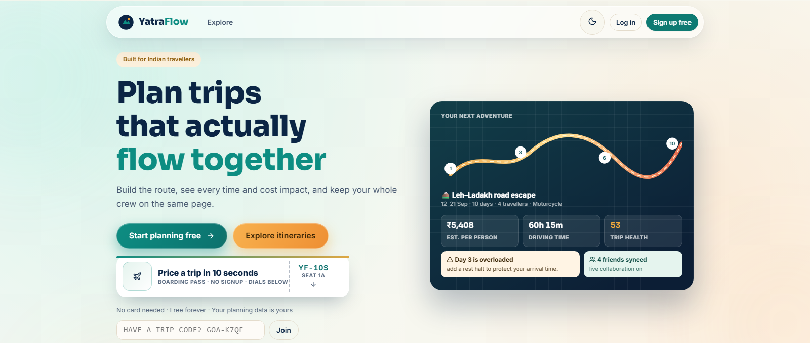
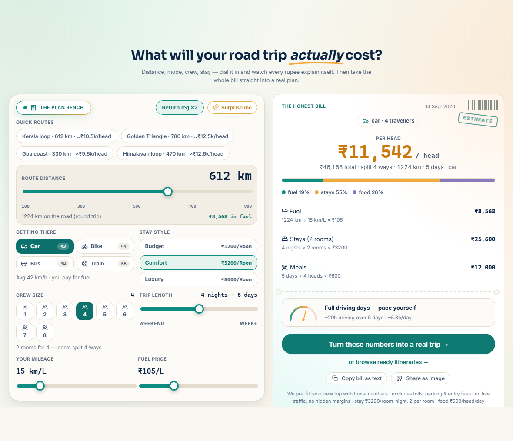

<div align="center">

# YatraFlow 🇮🇳

**Plan Indian trips together — not in a chaotic group chat.**

A collaborative travel-planning web app, built India-first. Real multi-day itineraries, transparent cost & time estimates in ₹, group voting on stops, decisions that settle debates, and interactive maps of your whole route.

**Free to use. No API key needed for maps, weather or routing.**

<br />

<a href="https://yatraflow-blond.vercel.app"></a>
&nbsp;
<a href="https://github.com/hasnaina955/Yatraflow/releases"></a>
&nbsp;
<a href="https://github.com/hasnaina955/Yatraflow"></a>
&nbsp;
<a href="https://github.com/hasnaina955/Yatraflow/network/members"></a>

<br />

<a href="https://github.com/hasnaina955/Yatraflow"></a>
<a href="https://vitejs.dev"></a>
<a href="https://www.typescriptlang.org"></a>
<a href="https://supabase.com"></a>
<a href="https://maplibre.org"></a>

</div>

<br />





---

## What you get
<table width="100%">
<tr>
<td width="50%" valign="top">

#### 📍 Plan

- **Create trips** — start + ordered destinations (real place autocomplete), dates, crew size, transport mode (eight everyday modes incl. car rental and local trains), budget and travel style. The "Trip Ticket" starter prices your rough bill on demand and seeds the timeline with a starting outline
- **Day-by-day timeline** — reorder / move stops between days, opening hours, priorities, route sparklines, collapsible headers
- **One journey per day, however far you drive** — a real arrival clock, travelling strips for pure-travel legs, halts on any driving day, suggested real stop spots along the route
- **Leg-aware insertion** — picking a place auto-fills road distance, travel time and fuel cost

</td>
<td width="50%" valign="top">

#### 💰 Budget & time (transparently)

- **Schedule engine** — simulates each day leg-by-leg (OSRM road distances, per-mode speeds and ₹/km costs); flags tight days, missed check-ins, late arrivals
- **Budget engine** — totals split per-person vs group, essential vs optional, category breakdown, hotel nights
- **Every rupee attributed** — per-day cost bars show what each day really costs (expenses + that day's drive) against a daily-average line; hot days light up amber with a trim suggestion
- **Split expenses fairly** — tag who paid on any expense and a balances card shows who owes whom, with the simplest set of settlements spelled out
- **Impact Preview** — before you accept a suggestion, see ±time, ±distance, ±cost, new or cleared warnings
- Every estimate states its assumptions on-screen. **No fake live traffic or prices — ever.**

</td>
</tr>
<tr>
<td width="50%" valign="top">

#### 🗺 Maps & routing

- **Interactive MapLibre maps** — numbered stop pins per day, colour-coded routes, day filters, light/dark basemaps (OpenFreeMap — keyless, no request caps)
- **Real road routing** (OSRM) with silent offline fallback — planning never blocks
- **Nearby POIs** along your route (verified coordinates) plus fatigue-aware stop suggestions for long drives
- **Weather along the route** — per-day forecast from Open-Meteo (free, keyless) with icon, min/max °C, rain chance
- **Expandable map** — filter pills, marker-key chip, full-screen Expand mode

</td>
<td width="50%" valign="top">

#### 👥 Collaborate & share

- **Invite by link or short code** — friends join as owner / editor / commenter / viewer (enforced by Postgres RLS). The invite link is `#/join/<code>` where the code is short and trip-shaped (`GOABEACHWE-K7QF`), with a code box on the home screen for friends who only got the code
- **One group-input stream** — stop ideas and group decisions share one tab; whatever needs *your* vote floats to the top with a sidebar digest, and decision cards show exactly who voted for what and where the tally leans
- **Decisions** — structured polls with per-option cost/time impact and context, votes, resolve
- **Publish itineraries** to the public Explore gallery; readers copy any trip in one click
- **Creators get a public page** — `#/creator/:id` gathers a creator's bio, links, track record and every itinerary they've published, shareable in one link
- **Export / import** JSON, or a self-contained snapshot link (`#/share/<payload>`, zero server storage)

</td>
</tr>
</table>

---

_Release highlights, newest first — the full record lives in [CHANGELOG.md](CHANGELOG.md)._

## ✨ The v0.66 release, in plain words

- **The creator hub became an operating picture.** It used to open on your settings; it now opens on how your work is doing — one ruled strip of lifetime figures, then a recorded-traffic trend (visits, forks and unlocks over 7, 30 or 90 days) drawn from the *same* derivation the table beneath it reads, so the chart and the rows can never describe different windows. Below that, one row per publication carries its funnel and its actions, and the creator profile moved into a disclosure at the foot of the page where it no longer owns the fold.
- **The hub says what it doesn't know instead of printing a zero.** Unlocks come from the sales ledger, so an unread ledger leaves that stage *unknown* in the row and in the legend rather than showing "0", which would read as "nobody bought"; a window the log doesn't cover says so too. The trend takes keyboard focus and steps by day, a tap latches its readout instead of losing it on lift, and each row states its window ("in 30 days") and each rate its denominator ("11% of visits").
- **Map search stopped answering with your own city.** A free-text search carried no spatial constraint, so Google applied its guess from your IP address and a lunch search returned what was near *you* rather than near the trip. Both search surfaces now run as Search-Along-Route over the trip's actual road, and the keyless fallback stack ranks its merged hits by distance to the corridor. The results also draw on the map as selectable teal pins that clear with the search box — the engine's own suggestions keep their dashed gold pin.
- **The whole app took its high-end visual pass.** One typeface across every surface, one icon weight, and a pill navigation whose active indicator glides as a box instead of stretching as a shape, because the old flip visibly distorted the pill's rounded ends. The landing, the public itinerary and Explore gained the spacing and tray treatment the design plan called for, and the card you see when a link is pasted now renders in the app's own font again.

## ✨ The v0.62–v0.65 run, in plain words

- **Create Trip became a funnel, not a form.** Three numbered questions — Where / When / Who & how — with four curated India templates carrying engine-computed price bands, autosaved drafts you can resume, a readiness checklist that mirrors the submit rules, and a "moment after" screen that sends crew invites over WhatsApp, Telegram or SMS and opens the plan's first warnings.
- **The app installs and reads offline.** Add it to your home screen or install the Android APK: trips stay readable on a dead connection through a service worker and an on-device snapshot, and edits made offline queue durably and sync when the network returns.
- **The map gained a travel clock, and the crew gained presence.** The plan's position draws on the road as the day unfolds, collaborators see each other live, and a remote-edit banner plus a stale-update ledger replace silent clobbering. Decision cards carry their own comment threads, and the Balances card names the outstanding total with per-line mark-settled.
- **Creators upload their own covers.** A publication's share card stopped depending on third-party image hosts: covers upload from the device, are resized before they leave it (a 1.3 MB photo becomes ~78 KB, measured), and auto-suggested covers are backfilled into our own storage.
- **The AI companion learned to really answer.** Point it at an OpenAI-compatible endpoint (or the fast Jev router) and the drawer answers from it, with the deterministic offline router underneath — it rides behind a launch flag while it readies as the premium perk.
- **Shared links became crawlable** — robots.txt and a live sitemap list every published itinerary, so search engines can find the gallery.

## ✨ The v0.60–v0.61 run, in plain words

- **You can buy a plan now.** A creator can price a published itinerary and a reader can pay for it. The price is read server-side, so a tampered request cannot change what is charged; the unlock is granted only through a buyer-scoped path or the payment webhook, which is idempotent and also recovers a purchase that was confirmed but never saved — so a click can never charge twice for the same plan. The creator's Earnings tab shows the sales that actually happened, with the amount paid at the time of purchase rather than the current price.
- **The paywall moved to the wire.** Locked days used to travel to every visitor in full, with the lock being a CSS blur on the public page. A server-side read now stubs the paid days exactly as the free preview shows them, and it decides from your own session whether you are the creator, a buyer, or a visitor.
- **A plan file says what it is, and an older one is repaired rather than refused.** Exports carry a format version, and the importer walks an older file forward — renumbering stops, re-issuing duplicate ids, reconciling the date range — then tells you what it changed in one readable line. A file written by a newer build is refused, with the reason.
- **Every screen got a refinement pass.** The phone layouts that pushed controls off-screen, a Timeline reorder that silently did nothing, a calendar that hid under the bottom bar, text that went invisible in dark mode, decorative motion that kept running while scrolled out of view, and controls below the 40px touch floor. None of the colours or spacing tokens were redesigned.
- **The public pages stopped over-promising.** Fork says it needs an account; a page that fails to load no longer blames the creator; cards in a row finally sit on one line at one height; and the shared hero stays readable over any cover a creator uploads.

## ✨ The v0.56 release, in one line

- **Trip settings became a first-class citizen.** The crew, dates, budget and vehicle controls moved out of Share into their own eighth workspace tab; every choice you set there — drivers, vulnerable passengers, after-dinner driving, the exact tank and economy of your bike or EV — now persists across reloads instead of silently reverting, re-derives every surface that depends on it (map suggestions, budget pacing, day plans) instead of serving stale ones, and matches Create Trip option-for-option. Blank tank or economy fields no longer write car numbers onto a motorcycle or an EV.


## ✨ The v0.55 release, in one line

- **The Explore gallery got its supply chain.** A written import contract with a validator that rejects typos, placeholders and broken references; a CI gate that runs every shelf itinerary through the real engine (health ≥ 85, no high-severity warning, budget within ±15 % of the engine's own math); a demand-ranked backlog of the twenty trips India actually searches for; and the first six on the shelf — Coorg, Goa, Kerala, Mewar, Kashmir, Meghalaya — every fee cited to a source, every coordinate geocoded, every budget set by the engine rather than by wishful thinking. Vercel Web Analytics rides along, web-only.

## ✨ The v0.51–v0.54 run, in plain words

- **The suggestions stopped lying about distance.** On a 1,400 km drive every roadside dhaba and petrol pump used to read "50 km off-route" — the detour sum subtracted one routing engine's route total from another's internal legs, and the difference landed on every card. That phantom burned the day's detour budget on the first suggestion and quietly held back most of the rest. Detours are now measured against the same road the search ran along, so a place on the drawn road reads "on route".
- **The Day Planner came back to life.** On a load-balanced drive (say four days of 350 km) the planner was absorbing its own lunch into every night halt and could never fit a fuel stop — a 1,400 km trip produced **zero** meal and **zero** fuel suggestions, and the night-halt cards had nothing to anchor them at all. Lunch now survives unless it lands within an hour of the halt, fuel follows the tank across the whole corridor, and night halts search for a town at that day's actual road position.
- **Night halts anchor on real towns.** Google's locality data stops at village level on rural corridors (hamlets with no population to rank by), so the town anchor also consults OpenStreetMap's population-ranked `place=city|town` — the only source out there carrying a town with a bed — and a halt can no longer be anchored to a town hundreds of kilometres away; it reports an honest gap instead.
- **One road measurement, and honest failure when it fails.** The workspace and the Map tab each measured the same road on every open, doubling the load on the shared routing server that caused the very failures they could not recover from. One measurement now feeds the map, the budget and the suggestions, with a single retry — and since the routing facade quietly falls back to straight-line estimates, a chain that produced *only* estimates now counts as unresolved: the tab says so instead of drawing chords as if they were roads.
- **Create Trip behaves like its Plan Bench.** The bill's money rolls into place instead of swapping, the printed bill exists on a phone (it used to print into a hidden container), and two dead links are gone — the bench's "turn these numbers into a real trip" CTA landed on the marketing page instead of the Create Trip form, taking its prefill with it. A new test walks every in-app link against the router so that class cannot come back.

## ✨ The v0.50.2 run, in plain words

- **The app finally looks like an app, not a website.** The floating top bar is gone from the signed-in Android app — its controls moved to the Profile page (reachable from the bottom nav): dark/light under Appearance, your notifications with Mark all read, and account actions (Creator hub, Send feedback, Log out). The website is unchanged.

## ✨ The v0.50.1 run, in plain words

- **The app stopped flashing the website on launch.** Opening the installed app used to show the marketing home — top bar and all — while your session restored, then jump into the app home. Now it goes splash → loading → app home; the website's landing only appears for signed-out users, where it doubles as the login page.

## ✨ The v0.50.0 run, in plain words

- **Every trip edit sticks now.** Reordering, arrow moves, drag-and-drop, deletes and cross-day moves used to toast "Change saved" and then silently revert — the save path rebuilt the day grid from the pre-edit plan on every Keep. That defect is fixed and pinned by regression tests; verified live in Board and Timeline, surviving reload.

## ✨ The v0.49.0 run, in plain words

- **The Board is now a full editing surface.** Add, edit and delete stops without leaving it — deletes route through the same impact-preview confirmation as the Timeline, and both views share one stop-form implementation so they can't drift apart again. It also moved to the front of the tab rail: Overview → Board → Map → Timeline.
- **Drag-reorder actually sticks now.** Three separate realtime bugs used to let a collaborator's stale update snap your accepted reorder back — the last one surviving two prior fixes. All three are closed, with regression tests.
- **The whole open-issue backlog closed.** Demo trips can no longer pollute a real account on a flaky connection; "Delete forever" asks first; the notification badge and five warning labels now pass WCAG contrast; screen readers get a real name on the cover-image field, a full notification list, one consistent keyboard tablist across every tab surface, and a Profile page without a phantom empty column.

## ✨ The v0.48.0 run, in plain words

- **The Android app got a real bottom navigation bar.** Installed, the shell now has four destinations — Home, My trips, Explore, Profile — in a fixed bar above the gesture area, with a 48px tap target each and the active one marked for screen readers. The website never renders a byte of it. Every page-level bottom layer (toasts, the trip dock, the AI button, settings save bar) now clears it through one shared offset, so nothing hides under the bar any more.
- **The map stopped fighting the page.** A one-finger drag that started on the trip map used to pan the map and leave the page stuck; on touch, one finger now scrolls the page and two fingers pan the map (MapLibre shows its own hint). The fullscreen map keeps normal gestures — there is no page left to protect.
- **The keyboard no longer covers the field you're typing in** — the Android shell reflows instead of letting the keyboard float over the layout.
- **One green, one kicker, four blur tiers.** The design system collapsed primary buttons, focus rings and form accents onto a single teal, everything translucent onto four named blur tiers, and every micro-label onto one recipe — retyped out of literal ALL-CAPS so screen readers stop spelling words out. The stylesheet had also been declaring font weights the font never loaded.

## ✨ The v0.45–v0.47 run, in plain words

- **The create flow got a ticket, invites got codes.** Creating a trip is a Trip Ticket — a live boarding-pass starter that prices your rough bill on demand and seeds the timeline. Invites shrank to short trip-shaped codes (`GOABEACHWE-K7QF`) typed on the home screen, with a join flow that actually completes.
- **Operators got a console.** A masteradmin route (`#/admin`, never linked) gives the two admins a god-view over every user, trip, invite, publication and audit row, with every destructive action behind an audited, role-rechecking RPC.
- **Deletes are now reversible.** Deleting a trip moves it to a Trash instead of erasing it — restore within 30 days from a new Trash view in My Trips, or delete it forever. A soft-delete tombstone + restrictive RLS policy keep trashed trips invisible to everyone else, and a scheduled purge sweeps anything older than a month.
- **The app writes faster.** Bursts of edits (drag-reordering, settings keystrokes, undo/redo) coalesce into a single database write per trip, flushed the moment you switch tabs or close the page.
- **The Map tab grew a search box and cross-links.** Search any place right on the map and add it in one tap; click a stop pin to jump straight into the Timeline or Board.
- **Decisions got grounded.** Open decision cards show where the trip stands (road time, cost, health) plus a deterministic, data-grounded "(offline)" recommendation.
- **A backlog of small wins.** Browser push notifications (Profile opt-in, background-tab only), a "Send feedback" link that pre-fills the app version, and Explore pagination with "Load more".

## ✨ The v0.38–v0.44 run, in plain words

The last stretch of releases gave the Map tab a brain, taught the plan to learn from you, and turned sharing into a superpower:

- **The Map tab now thinks like a road-trip co-pilot.** Long drives are split into fatigue-spaced segments — stretch ~every 150 km, lunch ~every 300 (auto-slid into the 11:30–14:30 window), fuel on your tank's rhythm for self-drive trips, and a real city to sleep in every ~550 km — each matched to the best actual place on your route, with sightseeing suggestions flowing alongside (that column was quietly broken until v0.43 fixed the pipe that fed it). Hover a suggestion to see it glow on the map; hover a pin to find its card. New stops insert in road order — add something between two confirmed stops and the plan reads A → B → C.
- **The engine learns you.** Accepting or declining an idea teaches Trip DNA, which biases future suggestions across all your trips. Big crews and relaxed styles get earlier breaks; packed itineraries push further. Rainy days hand the spotlight to museums and cafes; ghat sections and city crawls earn their own warnings.
- **Leave with the plan, any way you like.** The Share tab (a clean tabbed page now) exports a calendar file — one event per day plus timed events for hotels, trains and fixed commitments — prints the whole plan as A4 day cards straight from the browser's print dialog (a real offline PDF, zero dependencies), and keeps the snapshot links and JSON exports.
- **Creators got a hub.** Publications live in an Overview + Earnings surface: lifetime views, forks, live pages, a payouts-ledger shape the premium launch later filled in (v0.61), and a clearly-labelled projection of what priced pages could earn.
- **The money and the clock, where you're editing.** The Budget tab answers "what can we still spend today?" with a Safe-to-spend-per-day tile that counts the remaining days honestly (today included, a finished trip at zero) and goes red on overspend — or asks you to set a target instead of inventing a number. Timeline day headers carry two quiet chips: what the day costs (travel vs entries in the tooltip) and how long you'll be at its stops.
- **Quiet reliability work throughout** — every trip edit now writes through to the database before the UI celebrates, failed saves say so instead of silently vanishing on refresh, an already-open tab reloads itself into a fresh deploy instead of crashing on a stale chunk, public itinerary pages and invite links work for people who aren't members yet, and a corrupted-merge incident (v0.43) was repaired byte-for-byte.

<details>
<summary><b>See the full tour of features</b></summary>

<br />

The depth below ships in the app today — it is condensed here to keep the front door scannable.

- **Fuel-accurate costs** — car/bike trips state fuel economy (km/L) and optionally local pump price (default ₹105/L national average); legs are priced as `distance ÷ economy × price`, and the return to start is included by default (toggleable).
- **Travel stops act as real halts** — pure-travel legs render as travelling strips; stay days show "Based in …"; the drive home appears only on the return day, never double-counted.
- **Fatigue-aware stop planner** — splits long drives into stretch / meal / fuel / overnight segments and matches each to the best real place by purpose (night halts anchored on key cities; vehicle-profile aware for fuel range, EV/CNG queries).
- **Opening hours auto-fill** from OSM Overpass where relevant (POIs, temples, food, hotels), context-aware.
- **Location autocomplete** — Google Places when a key is set, otherwise the keyless stack (Mappls · Open-Meteo · Wikipedia · OSM).

</details>

---

## 🚀 Getting started

```bash
git clone https://github.com/hasnaina955/Yatraflow.git
cd Yatraflow
npm install

# Configure Supabase (free project at supabase.com, then:)
cp .env.example .env.local   # VITE_SUPABASE_URL + VITE_SUPABASE_ANON_KEY
# Apply the schema (SQL editor in the dashboard, or with PGCONN set):
#   node scripts/apply-schema.mjs

npm run dev        # → http://localhost:5173
```

**One-command start (Windows):** `./scripts/start.ps1` boots install-if-needed dev server (`-Test` runs the suite, `-Build` runs the build; `make-dev-shortcut.ps1` adds a desktop shortcut)

You'll need a free [Supabase](https://supabase.com) project for accounts + data; the maps / weather / geocoding services the app calls are all free and keyless

## 👤 Accounts & demo content

- **Sign up** with any email + password (min 8 chars) — new accounts get a seeded Kerala demo trip on first login
- Already have trips? Use the **🚀 Load demo trips** button on My Trips anytime
- Your data lives in Supabase and follows you across devices; invited collaborators act per their role, enforced by Postgres RLS

---
## 🛠 Tech stack

| Layer | Choice | Why |
|---|---|---|
| Build | [Vite 8](https://vitejs.dev) | Instant dev server, zero-config builds |
| UI | React 18 + TypeScript (strict) | No router lib or UI kit — hash routing + hand-rolled components stay lightweight |
| State | `useSyncExternalStore` over a module store | Tiny reactive cache hydrated from Supabase; every mutation writes through |
| Maps | [mapcn](https://github.com/AnmolSaini16/mapcn) (MapLibre GL) | [OpenFreeMap](https://openfreemap.org) basemaps tick light/dark — no key, no signup, no caps |
| Backend | [Supabase](https://supabase.com) (Postgres + Auth + RLS) | Free tier covers the MVP; JSONB keeps trip internals denormalized |
| Routing / geo | OSRM, Open-Meteo, Wikipedia, Overpass | Free + keyless, India-biasable; optional Google / Mappls keys — the free stack is the default; a Google key makes suggestions Google-only |

Routing is hash-based (`#/trip/:id`, `#/pub/:slug`, `#/creator/:id`, `#/join/:code`) so the static build runs on any host with no rewrites.

## 📁 Project structure

```
src/
├── main.tsx           # Entry — mounts <App/> inside <ErrorBoundary/>
├── App.tsx            # Hash router, nav shell, footer, notifications
├── styles.css         # Single hand-written stylesheet (light+dark via data-theme)
├── data/              # types.ts domain model · seed.ts demo content
├── store/store.ts     # Supabase-backed reactive cache + all mutations
├── lib/               # engine.ts · impact.ts · ai.ts · ridePlan.ts · geocode.ts
│                      # routing.ts · snapshot.ts · weather.ts
├── components/        # ui.tsx · StopEditor.tsx · TripMap.tsx · ImpactPreview.tsx · PubCard.tsx · mapcn/
└── pages/             # Landing · Auth · TripsList · CreateTrip · TripCreated · TripWorkspace · Explore
                       # PublicItinerary · Purchases · CreatorPage · CreatorHubPage · Profile · AdminPage
                       # NativeHome + trip/ (one file per workspace tab)
```

Deep dives: [docs/ARCHITECTURE.md](docs/ARCHITECTURE.md) (data model, engine math, store), [DESIGN_TOKENS.md](DESIGN_TOKENS.md) (design tokens), [docs/README.md](docs/README.md) (full index).

---

## 🗺 Data sources, basemaps & attribution

Every map/data service is **free and keyless** unless the row says otherwise — the app never requires an API key to render a map.

| Concern | Provider | Licensing / terms |
|---|---|---|
| **Basemap tiles** | [OpenFreeMap](https://openfreemap.org) (OpenMapTiles-schema) | MIT — no request limits; map data © [OSM](https://www.openstreetmap.org/copyright) contributors (ODbL) |
| Road routing | [OSRM](https://project-osrm.org/) demo server | Free, keyless; haversine fallback works offline |
| Weather | [Open-Meteo](https://open-meteo.com) | Free, keyless, CC-BY 4.0 |
| Geocoding / POIs | Open-Meteo, Wikipedia geosearch, [Overpass (OSM)](https://overpass-api.de) | Free / ODbL |
| Place autocomplete (opt-in) | [Mappls](https://about.mappls.com/api/) when `VITE_MAPPLS_KEY` is set | Free India dev tier, key required |
| Places & Routes (opt-in) | [Google Maps Platform](https://mapsplatform.google.com) when `VITE_GOOGLE_MAPS_API_KEY` is set | Needs billing; client-side quota guard caps each SKU at 80% of free allowance. With a key, suggestions are Google-only (no free-stack fallback); without one, the free stack serves. One deliberate exception: **night-halt towns** also come from OpenStreetMap's `place=city\|town` (population-ranked) — Google's locality data stops at village level on rural corridors, and a halt needs a town with a bed. |

MapLibre renders the required OSM/OpenMapTiles credit in every map corner.

---

## ☁️ Deployment

Static hosting is enough. The repo auto-deploys to **Vercel** on every push to `main` (`npm run build`, output `dist/`). Any static host works — Netlify, GitHub Pages behind a base path — because routing is hash-based.

**Preview builds need the Supabase vars too.** Vite inlines `VITE_SUPABASE_URL` / `VITE_SUPABASE_ANON_KEY` at build time and Vercel scopes them per environment — tick **Production, Preview and Development**, then **Redeploy**; the build guard in `vite.config.ts` fails a Vercel deploy if either is missing. See [docs/DEPLOYMENT.md](docs/DEPLOYMENT.md#if-login-fails-on-a-preview-but-works-on-production).

---

## 📌 MVP constraints (intentional)

- ❌ Hotel/flight **booking** — out of scope. Stops can be flagged *needs booking*, and you add your own confirmations as timed events, but the app never books or links to a booking flow
- 💳 **Payments for paid itineraries** — live since v0.61 (Razorpay checkout + idempotent webhook); what stays manual is creator payout disbursement, worked from the hub's earnings ledger
- ❌ **Live traffic/prices** — all estimates are transparent formulas with stated assumptions
- ❌ INR is the default and only currency

These are extension points, not oversights — see ARCHITECTURE.md's "Swapping things out".

## Testing the crew shape (opt-in integration gate)

The node suite runs offline. To assert crew behavior against the real database,
create two throwaway accounts and run the integration harness -- opt-in only, so
it never gates offline verify:

```powershell
# in .env.local (or environment):
#   TEST_USER1_EMAIL=crew-a@example.com   TEST_USER1_PASS=<password>
#   TEST_USER2_EMAIL=crew-b@example.com   TEST_USER2_PASS=<password>
VITE_RUN_INTEGRATION=1 npm run test:integration
```

The harness asserts the cross-user row-level behavior two crews actually rely on
(private-trip privacy, self-serve join, the editor gate, recipient-only
notifications, public gallery reads, realtime round-trips) with a unique run-id
prefix per run and a printed teardown ledger -- only rows the run created are
ever touched. The catalog-level shape is additionally locked by
`supabase/tests/rls_contract.test.sql` (run in the dashboard SQL editor).

## Rendering the money surfaces (local creator fixture)

The earnings ledger, the payout-runs ledger and the publish editor need a creator
with real sales behind them, and a node test cannot supply one -- the suite has no
DOM and no session. The fixture builds that account:

```bash
node scripts/seedCreatorFixture.mjs            # dry run: prints the plan
node scripts/seedCreatorFixture.mjs --apply    # create the accounts + rows
node scripts/seedCreatorFixture.mjs --clean    # remove the fixture's rows
```

It works on the project `VITE_SUPABASE_URL` points at, creating a creator, an
admin, three buyers, three priced publications, seven backdated sales and 100
days of backdated visits and forks — the last so the hub's funnel renders a trend
rather than an empty one — then prints the credentials, the deep links
(`#/creator-hub`, the publish editor, the creator page, `#/admin` → Analytics)
and any SQL it could not run. The sales are
the same ones `tests/earnings.test.ts` (per creator) and `tests/admin.test.ts`
(platform-wide) pin, so the numbers on screen have an answer key — including the
console's, where two payees are what make "charged once per creator" a different
figure from one ladder over the platform total. The traffic plan lives in
`scripts/fixtureFunnelPlan.mjs`, a pure module rather than the CLI script itself
(that runs its whole seed on import, so a test cannot import it to check its
numbers), and `tests/pub-funnel.test.ts` runs the shipped derivation over the very
events the fixture writes — so the windows the script prints before writing
anything are checked against the arithmetic the app uses. Two things need
elevation, and
the script says so rather than half-seeding: the sales rows, because
`entitlements` is SELECT-only for authenticated clients by design, and the
admin's role, because it lives in the JWT's `app_metadata` and there is
deliberately no `is_admin` column to flip. Set `SUPABASE_SERVICE_ROLE_KEY` (or
`PGCONN`) to have both applied, and without either the script prints the SQL to
paste into the dashboard instead. It only ever touches the rows it names.

The write plumbing is `scripts/fixtureKit.mjs` -- sessions, ownership inserts,
the elevated writer, chunked bulk inserts, the admin promotion -- so the next
session-gated surface (an analytics screen, a money path) seeds its own browser
check from the same harness instead of copying this script's internals. A new
fixture is a pure plan module (see `fixtureFunnelPlan.mjs`) plus a thin CLI over
the kit; `tests/fixture-kit.test.ts` keeps the kit the only write path.
## Migration status (is the database actually updated?)

The database half of a release is the one part the offline gate cannot see:
`npm run verify` typechecks, tests and builds, and says nothing about SQL that
has never run. This asks the live project directly -- read-only, with the app's
own anon key:

```bash
npm run check:migrations              # applied / MISSING per migration
npm run check:migrations -- --list    # what it would probe, with no network
```

For every file in `supabase/migrations/` it derives the artifacts that migration
creates -- a table, a column, a Storage bucket -- from its own SQL, and reports
which are live. Exit **0** means everything it can probe is present; **1** means
something is missing, or could not be checked (which is not the same as present);
**2** means no credentials. Function-, policy- and trigger-only migrations are
listed as having no probe surface, with the reason.

The check found its first real one the day it was written: `trips.stay_style`
was absent from the live database, so the stay-budget tier reverted on every
reload without a word from the app. Applying that migration's own one-line
`alter table` closed it the same day, and the sweep went from 1 missing to 0.

## 🤝 Contributing

PRs welcome! Keep TypeScript strict clean, match the existing style (plain CSS in `styles.css`, no new UI/router/state libs without discussion), preserve the transparency promise, and respect the MVP constraints. See [CONTRIBUTING.md](CONTRIBUTING.md).

---

<div align="center">

*Built India-first. Yatra (यात्रा) means journey.* 🧭

</div>
